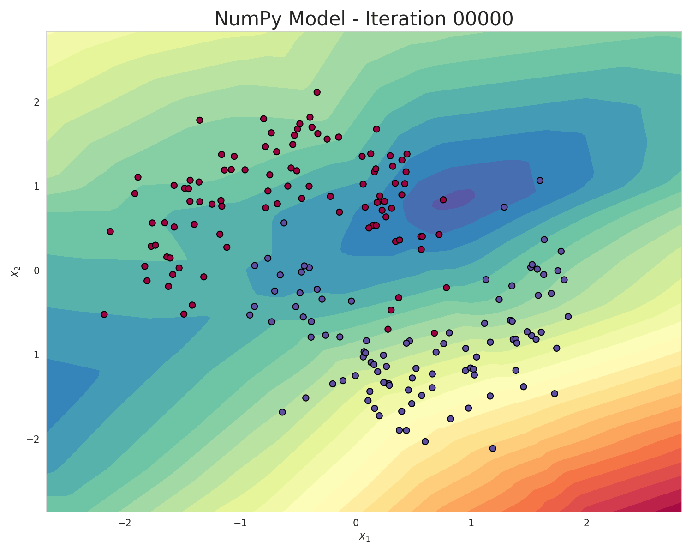
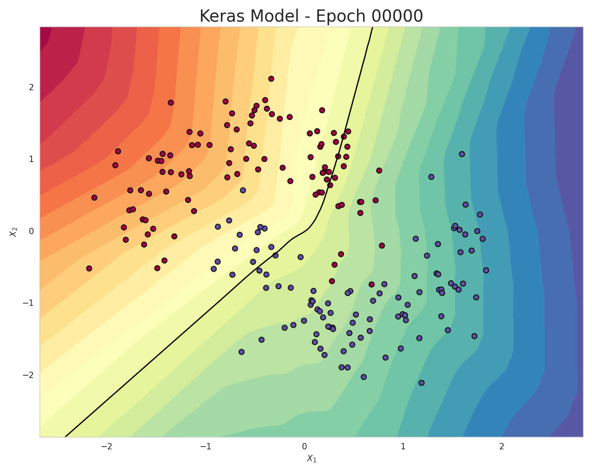

# NumPy Neural Network vs Keras Neural Network

This project compares a neural network built from scratch with NumPy against a Keras implementation on the same binary classification task. Both models are trained on the synthetic scikit-learn moons dataset and use the same architecture, learning rate, and loss function so the comparison reflects implementation differences rather than different model setup.


## Overview

The repository demonstrates:

- Manual neural-network training in `src/models/nn.py`
- A Keras-based equivalent in `src/models/keras_model.py`
- Data generation and preprocessing from `data/`
- Visualization helpers for plots and decision boundaries
- End-to-end training and evaluation from `main.py`

## Problem setup

The task is binary classification on a synthetic moons dataset created via scikit-learn's `make_moons` function. The dataset is split and processed before both models are trained.

## Model architecture

Both networks are built according to the following architecture:

- Input layer: 2 features
- Hidden layers: 32, 16 neurons
- Output layer: 1 neuron
- Activations: ReLU for hidden layers, sigmoid for the output layer
- Loss: Binary Cross-Entropy (BCE)
- Learning rate: 0.01

The NumPy implementation manually handles:

- weight and bias initialization
- forward propagation
- loss computation
- backpropagation
- gradient descent updates

## Repository structure

```text
.
├── data/
│   ├── datasets/
│   ├── generate_data.py
│   ├── preprocess_data.py
│   └── __init__.py
├── src/
│   ├── models/
│   │   ├── __init__.py
│   │   ├── keras_model.py
│   │   └── nn.py
│   ├── training/
│   │   ├── __init__.py
│   │   └── train.py
│   └── utils/
│       ├── __init__.py
│       ├── callbacks.py
│       └── visualize.py
├── main.py
├── math_notes.md
├── requirements.txt
├── README.md
├── linear_layer_animation.gif
└── .gitignore
```

## Setup

Create a virtual environment and install the dependencies:

```bash
python -m venv .venv
source .venv/bin/activate
python -m pip install -r requirements.txt
```

## Run the project

```bash
python main.py
```

This script will:

1. generate the moons dataset
2. save the dataset to `data/datasets/moon.csv`
3. visualize the raw data in `results/moon_data.png`
4. train the NumPy network
5. train the Keras network
6. print the test accuracy for each model

## Notes

- `main.py` is the entry point for the full experiment.
- `math_notes.md` contains notes about the mathematical derivation of forward propagation, BCE loss, and backpropagation functions.
- `results/` is created at runtime for plots and saved model artifacts.

## Expected output

The script prints accuracy for both implementations, for example:

```text
Test Accuracy of Numpy NN: 0.90
Test Accuracy of Keras NN: 0.94
```

## Observations

NumPy ANN, although sharing the same architecture and hyperparameters as the Keras model, needs a lot more epochs to achieve a similar decision boundary and manage to efficiently separate the two classes:

<table>
  <tr>
    <td align="center">
      
    </td>
    <td align="center">
      
    </td>
  </tr>
  <tr>
    <td align="center"><b>NumPy ANN</b></td>
    <td align="center"><b>Keras ANN</b></td>
  </tr>
</table>
